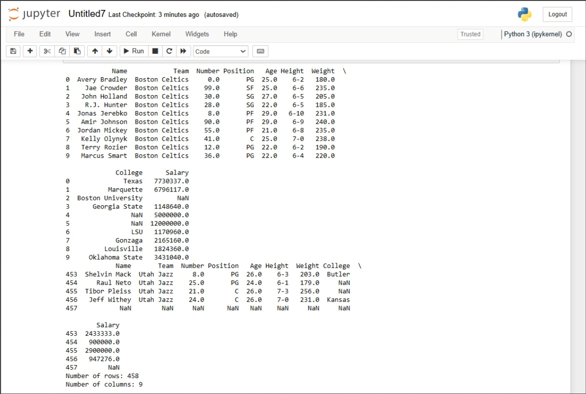

# Read-from-CSV

## AIM:
TO write a program for reading a csv file.
## ALGORITHM:
### Step 1:
Import pandas library using import statement. 
### Step 2:
Read the contents of the given csv file using read_csv() method and pass the name of the file with '.csv' extension as the argument. make sure that the data file and the program are saved in the same location,otherwise mention the file's full path.
### Step 3:
Display the first few indices of the file using head() method and pass required number of indices as the argument. The default number of indices displayed in 5.
### Step 4:
Display the last few indices of the file using tail()
method and pass required number of indices as the argument. The default number of indices displayed is 5.
### Step 5:
End the program.

## PROGRAM:
```'''
Developed by: MARELLA HASINI
Register No: 212223240083
'''
To write a python program for reading content from a CSV file.
import pandas as pd
df = pd.read_csv('nba.csv')
print(df.head(10))
print(df.tail())
print("Number of rows:",len(df.axes[0]))
print("Number of columns:",len(df.axes[1]))

```
## OUTPUT:



## RESULT:
Thus the program created successfully.